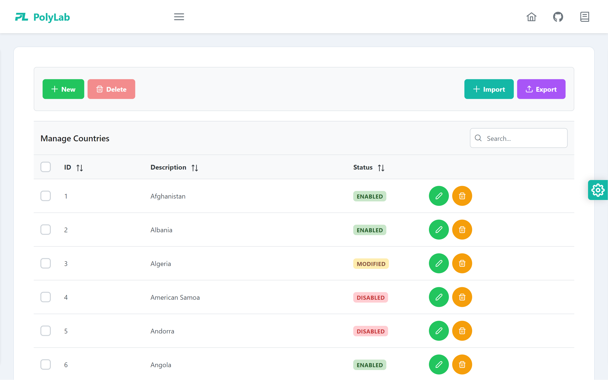
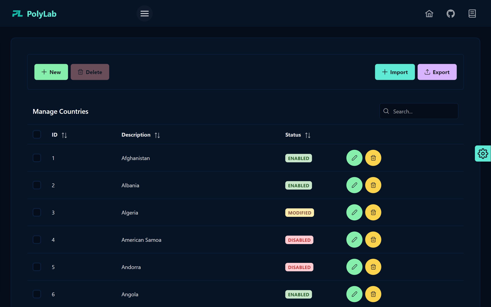
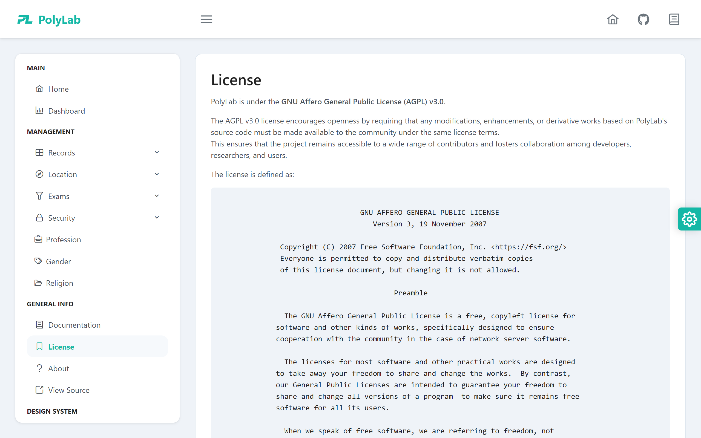

<a name="readme-top"></a>
<br />

<div align="center">
  <a href="#">
   <!-- Replace this logo for a custom official logo -->
    
  </a>

<h1 align = "center">
<b><i>PolyLab</i></b>
</h1>
    <!-- Add/Remove categories depending on your project -->
  <p align="center">
    A sample Angular micro front-end for a LIMS
    <br />
    <!-- IMPORTANT NOTE: If you want to append emojis you'll need to add the '-' sign before and after the header, as shown below:  -->
    <a href="#-screenshots-">Screenshots</a>
    ·
    <a href="#-requirements-">Requirements</a>
    ·
    <a href="#-architecture-">Architecture</a>
    ·
     <a href="#-technologies-">Technologies</a>
    ·
    <a href="#-license-">License</a>
  </p>
</div>

<!-- Here goes the project description -->

**PolyLab** is a sample Angular micro front-end for a Laboratory Information Management System (LIMS). It provides a user-friendly interface for managing laboratory data and workflows.

## 📷 Screenshots 📷 

PolyLab's user interface is crafted with a focus on simplicity, elegance, interactivity and intuitive user experience. The thoughtful color palette and typography choices enhance readability and ensure a visually appealing presentation of data.

It seamlessly integrates both dark and light modes, allowing users to effortlessly switch between the two based on their preferences.

| Light                                      | Night                                     |
| ------------------------------------------ | ----------------------------------------- |
|    |    |
|    |    |
|  |  |

## 📝 Requirements 📝 

PolyLab has the following requirements:

- Node.js 18.16.0 or higher, as specified by the [`.nvmrc`](/.nvmrc) file.
- Angular CLI 16.0 or higher
- [PolyLab API](<(https://github.com/jxareas/PolyLab-REST)>) to connect to

Here are the instructions on how to setup the project locally:

1. Install and run the [PolyLab-API](https://github.com/jxareas/PolyLab-API).
2. Clone the repo

```bash
git clone https://github.com/jxareas/PolyLab.git
```

3. Install NPM packages

```bash
yarn install
```

## 🛠 Architecture 🛠 

**PolyLab** follows a micro front-end architecture, using Angular as the front-end
framework.
It is designed to be integrated with a [backend API](https://github.com/jxareas/PolyLab-API) that provides the necessary data and functionality for managing laboratory information.

This project is built using a modular approach, with each module encapsulating a specific set of features.

## 🦾 Technologies 🦾 

The project uses the following frameworks & libraries:

- **Angular**: a comprehensive framework that allows for the development of dynamic, high-performance web applications.
- **TypeScript**: a strongly typed superset of JavaScript that compiles to plain JavaScript. It brings static typing, enhanced tooling, and improved developer experience to the JavaScript ecosystem.
- **RxJs**: a reactive programming library that enables handling asynchronous and event-based programming in a more convenient and efficient manner. It provides powerful tools for composing and manipulating asynchronous streams of data.
- **PrimeNG**: a collection of rich UI components for Angular applications. It offers a wide range of customizable and feature-rich components such as data tables, forms, charts, and more
- **Angular Material**: a UI component library built by the Angular team that provides a rich set of pre-built UI components based on Google's Material Design guidelines.
- **ESLint**: a pluggable static code analysis tool for identifying problematic patterns found in JavaScript and TypeScript code.
- **Lint-staged**: a tool that allows running linters on staged files in a Git repository. It works in conjunction with Husky and enables developers to define specific linting tasks to be performed on files that are staged for committing.
- **Husky**: a git hook management tool that allows running scripts or commands before git events such as commit, push, and more.
- **Prettier**: an opinionated code formatter that enforces consistent code style and formatting rules across the project.
<p align="right">(<a href="#readme-top">back to top</a>)</p>

## 📜 License 📜 

<!-- Change this license for the one used in your project -->

PolyLab is licensed under the [GNU Affero GPL v3.0](https://github.com/jxareas/PolyLab/blob/master/LICENSE).

<p align="right">(<a href="#readme-top">back to top</a>)</p>

<!-- This is a custom version of the Read-My-README template, by Jon Areas,
found at: https://github.com/jxareas/read-my-readme -->
