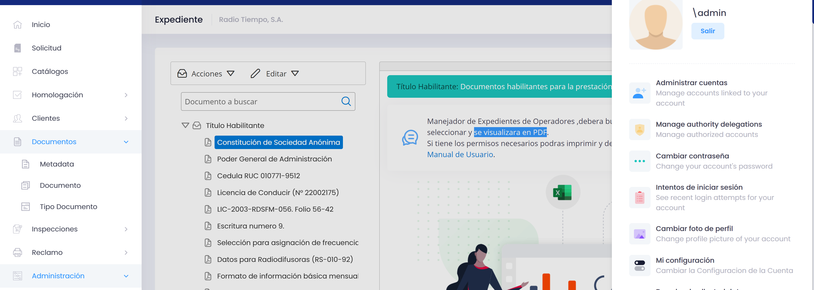

<a name="readme-top"></a>
<br />

<div align="center">
  <a href="#">
   <!-- Replace this logos for a custom official logos -->
    
  </a>

<h1 align = "center">
<b><i>MDS - Light</i></b>
</h1>
    <!-- Add/Remove categories depending on your project -->
  <p align="center">
    A Minimalist Helper Library for Enterprise Applications
    <br />
    <!-- IMPORTANT NOTE: If you want to append emojis you'll need to add the '-' sign before and after the header, as shown below:  -->
    <a href="#-screenshots-">Screenshots</a>
    ·
    <a href="#-license-">License</a>
  </p>
</div>

<!-- Here goes the project description -->

**MDS** is a internal angular library designed to enhance the development of enterprise applications. It provides a set of components, services, pipes, and directives that can be easily integrated into your projects, offering improved functionality and ease of use.

**Note:** _The library version currently implemented within this project is a minimal and selectively curated iteration derived from the original library, designed to meet the project's specific requirements._

## 📷 Screenshots 📷



<p align="right">(<a href="#readme-top">back to top</a>)</p>

## 📜 License 📜

<!-- Change this license for the one used in your project -->

```
MIT License

Copyright (c) 2021 Jonathan Areas

Permission is hereby granted, free of charge, to any person obtaining a copy
of this software and associated documentation files (the "Software"), to deal
in the Software without restriction, including without limitation the rights
to use, copy, modify, merge, publish, distribute, sublicense, and/or sell
copies of the Software, and to permit persons to whom the Software is
furnished to do so, subject to the following conditions:

The above copyright notice and this permission notice shall be included in all
copies or substantial portions of the Software.

THE SOFTWARE IS PROVIDED "AS IS", WITHOUT WARRANTY OF ANY KIND, EXPRESS OR
IMPLIED, INCLUDING BUT NOT LIMITED TO THE WARRANTIES OF MERCHANTABILITY,
FITNESS FOR A PARTICULAR PURPOSE AND NONINFRINGEMENT. IN NO EVENT SHALL THE
AUTHORS OR COPYRIGHT HOLDERS BE LIABLE FOR ANY CLAIM, DAMAGES OR OTHER
LIABILITY, WHETHER IN AN ACTION OF CONTRACT, TORT OR OTHERWISE, ARISING FROM,
OUT OF OR IN CONNECTION WITH THE SOFTWARE OR THE USE OR OTHER DEALINGS IN THE
SOFTWARE.
```

<p align="right">(<a href="#readme-top">back to top</a>)</p>

<!-- This is a custom version of the Read-My-README template, by Jon Areas,
found at: https://github.com/jxareas/read-my-readme -->
